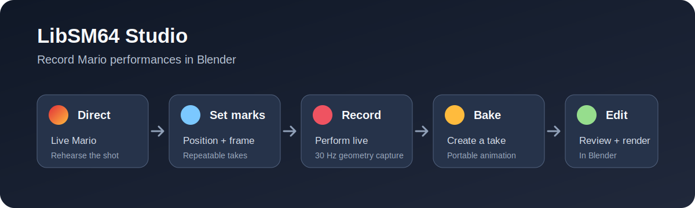

# LibSM64 Studio

**Record Mario performances in Blender.**

LibSM64 Studio integrates [libsm64](https://github.com/libsm64/libsm64) with
Blender so you can direct a controllable Live Mario, rehearse a shot, record a
performance, and bake it into a portable Blender animation. The result is a
self-contained take that can be edited, reviewed, rendered, and reopened
without the ROM, controller, or live simulation.

Fast64 terrain and collision metadata remain supported for scene compatibility,
but they are not required and are no longer the focus of the product. LibSM64
Studio is a performance-capture workflow for Mario in Blender.

**Warning:** This plugin hasn't been battle-tested for very long, save often and use at your own risk!

If you find a way to crash it, please post an issue or otherwise let me know!



See [the media capture guide](docs/media-capture.md) for the release-quality
screenshots and demonstration footage that accompany this workflow.

## Installation

Windows and Linux are currently supported; macOS is not yet supported.

Download the latest [LibSM64 Studio release ZIP](https://github.com/spencamp/libsm64-studio/releases).
In Blender, open **Edit → Preferences**, choose **Add-ons** (or **Get
Extensions → ▾ → Install from Disk** in newer Blender releases), select the ZIP,
then search for **LibSM64 Studio** and enable it. If it does not appear, enable
**Auto Run Python Scripts** in Preferences.

When upgrading an existing development build, disable the add-on, close Blender,
delete the existing `libsm64_studio` add-on directory, and then install the new
ZIP. Blender may overlay same-name add-ons without removing obsolete modules or
bytecode, which can create a mixed-file installation. The add-on now detects that
state and asks for a clean reinstall.

This release targets the modern `libsm64/libsm64` ABI pinned at the exact
upstream commit `fd11813208272b4271d92bd92feb8f3fdbe61be5`. Both bundled
libraries, the Python declarations, and the generated C ABI probe data refer to
that same header revision. At runtime Studio validates the manifest, artifact
SHA-256, structure layout, required exports, and function signatures before any
libsm64 initialization call.

## Start a studio session

Before opening Blender, connect an XInput controller to perform with one;
keyboard control is also available. In the 3D Viewport sidebar (`N`), open the
**LibSM64 Studio** tab, browse to an unmodified SM64 US z64 ROM, and click
**Start Live Mario** to place a controllable Mario at the 3D cursor. Use
**End Studio Session** when finished; it also performs deferred rejected-take
cleanup.

*Note:* The SM64 US ROM must be the one with the SHA1 checksum of `9bef1128717f958171a4afac3ed78ee2bb4e86ce`.

### Scene collision

**Start Live Mario** prepares a fixed 3x3 neighborhood of 256-Blender-unit
world-space X/Y chunks around the 3D cursor and creates one native surface object
per non-empty chunk before Mario is created. As Mario crosses chunk boundaries,
incoming chunks are created first and distant chunks outside a 5x5 retention
neighborhood are deleted afterward. Mario remains the same native instance, so
movement, Start Marks, and recording continue across transitions.

Collision extraction uses evaluated meshes, modifiers, world transforms,
Fast64/simple surface types, and terrain metadata. Object and clipped-chunk data
are cached for the Studio Session. Clearly distant separate objects receive only
an inexpensive bounds scan until their chunks are needed; a very large joined
mesh may still need one expensive extraction because Blender exposes it as one
object. If relevant scene collision changes while Live Mario is running, Studio
marks it dirty and shows a restart notice instead of silently replacing the
currently active native collision. The modern 32-bit fields remove the old
signed-16-bit storage restriction, but scene size and libsm64 broadphase behavior
are not unlimited.

Mesh objects may opt into **LibSM64 Collision Role > Moving Platform** in Object
properties before Live Mario starts. Moving platforms are excluded from static
chunks, own one persistent native surface object, and follow the evaluated
`matrix_world`, including object animation, parents, constraints, and drivers.
Studio samples their transforms immediately before each Mario tick, so native
platform velocity can carry Mario without recreating him. Scale is baked into
local platform vertices at creation; animated scale, shear, topology changes,
and modifier-result changes are rejected with a restart notice instead of
silently producing invalid collision. The default role remains **Static**;
**Excluded** omits an object from Studio collision.

### Global water and poison gas

The Environment section provides independent **Enable Water** / **Water Height**
and **Enable Poison Gas** / **Gas Height** controls. Heights are Blender world Z
values and are converted through the same session origin and Blender-to-SM64
scale as Mario and collision. Enabled values are applied after Mario creation,
after Start Mark recreation, and immediately when edited without replacing
Mario. Disabling either level writes the pinned implementation's canonical
no-region value, native `-10000`; disabled controls do not require their optional
native export merely to start Live Mario. These are single global levels, not
spatial volumes or rendered water surfaces.

### Wing, Metal, and Vanish Caps

Performance Controls can grant the pinned Wing (`0x00000008`), Metal
(`0x00000004`), and Vanish (`0x00000002`) cap flags and extend the current cap.
Duration is shown in 30 Hz game ticks. A grant duration of zero intentionally
uses libsm64's defaults: 1800 ticks for Wing and 600 ticks for Metal or Vanish.
Until live audio is enabled, cap music is always requested off. Granting a cap
forces a full live mesh UV/color refresh so a take recorded and baked while one
cap remains active inherits that visible source-mesh state as well as its pose
geometry.

There is no cap-removal control: the pinned API exposes no removal function, and
clearing public flag bits would not safely clear cap timers, actions, or music.
Start Marks observe and can restore the public cap flag through Performance
State restoration, but the cap timer and other internal cap state are not in
`SM64MarioState`, so reset is not an exact cap-duration restore. Per-sample
UV/color animation is not baked; change caps between separate takes when their
appearance must differ over time.

### Per-take runtime metadata

Every recorded geometry sample also owns an immutable same-tick public Mario
state record: native position/velocity, facing and forward velocity, health,
action, animation ID/frame, flags, particle flags, and invincibility. Committing
a take creates one exclusively owned Blender Text datablock named like
`LibSM64 Studio Take 001 Runtime Metadata`. It contains compact JSON schema 1
with 30 Hz sample rate, target FPS, sample count, constant-held sample-to-frame
mapping, coordinate conventions, take owner ID, and the per-sample records.

The selected take's read-only Runtime Metadata inspector follows the current
integer or fractional Blender frame using the same constant-held timing as the
baked transform/pose actions. Text ownership is included in registration
rollback and rejected-take cleanup, so later takes and route edits cannot rewrite
an earlier take's metadata. Legacy takes simply show that no runtime metadata is
available. The Text survives save/reopen and remains directly inspectable when
the add-on, ROM, and native library are absent. Metadata is observational: it
does not drive or change visual playback.

### Optional live audio

The Audio section can enable live 32,000 Hz signed-16-bit stereo SM64 audio,
adjust output volume, and mute playback. Studio uses Blender 5.2's bundled
Audaspace `Sequence` with in-memory NumPy buffers; it creates no WAV files and
requires no external Python package. A dedicated worker keeps a bounded queue
of the two 528/544-frame native blocks returned by each `sm64_audio_tick()`.
Audaspace sequence mutation is internally locked, and one Studio-owned native
call lock serializes audio generation with Mario ticks, platform/surface calls,
state setters, deletion, and global termination.

Audio is optional and initialized at most once per native generation. Device or
backend failure disables audio while preserving Live Mario; an uncertain native
failure poisons the generation. Shutdown stops and joins the worker, closes the
device, and unregisters its retained sound callback before deleting any surface,
Mario, or global state. The validated ROM bytes are retained only in memory for
the active generation so audio may be enabled later; the ROM path is not copied
into take metadata, diagnostics, packages, or `.blend` data.

Cap music can be requested only while the audio worker/device is active and not
muted. Windows packaged Blender 5.2 is the currently automated backend target.
The same bundled Audaspace API exists on Linux, but Linux live-audio support is
not claimed until a packaged GUI audible test is performed there. Automated
device-open/PCM/queue tests do not substitute for the manual audible check.

### Directing and diagnostics

Performance Controls can set Mario's 16-bit health, increment his heal counter,
apply damage from the mapped Blender 3D Cursor position, set invincibility in
30 Hz ticks, or request the native kill state. These operations are available
during rehearsal or recording, validate their numeric ranges before calling
native code, and target only the exact owned Mario ID and lifecycle generation.
Kill does not delete Mario; use a valid Start Mark reset or restart the Studio
Session to recover a performance after death. Raw action and animation IDs are
not exposed as ordinary directing controls.

**Probe Collision at 3D Cursor** reports Blender/native coordinates, floor,
global water and gas levels, the static chunk key and active state, and nearby
surface counts. Native `-110000` is shown explicitly as **No floor**, while the
canonical `-10000` water/gas result is shown as no active level. The diagnostics
panel also displays the current public Mario state, moving-platform ownership,
Start Mark mode, cap history, audio statistics, metadata schema, the last
directing operation, and an independently enabled bounded native debug log.
**Enable Native Debug Messages** defaults off and may be toggled during a valid
session without replacing Mario. The retained debug callback
copies plain messages only; it never touches Blender RNA, is kept alive through
native cleanup, and is unregistered before global termination. Diagnostics never
include the ROM path or expose native pointers.

## Capture a Mario performance

The **Record a Mario Performance** panel is built around one controllable Live
Mario and any number of baked takes:

1. Set the scene FPS and start Live Mario. Live Mario immediately enters rehearsal
   mode and remains controllable between takes.
2. Maneuver Mario to the desired position and click **Set Start Mark**. Use
   **Reset to Mark** whenever you want to safely recreate Mario there. The
   default **Performance State** profile restores supported movement, health,
   action, animation, flags, and invincibility state; **Safe** omits action,
   animation, and flags.
3. Move the timeline to the desired output start frame and click **Set Start
   Frame**. Enable **Start recording from saved frame** to return to this frame
   automatically before each new capture. **Go to Start Frame** recalls it
   manually. Finishing or canceling preserves the frame reached by playback.
   The Timeline Start Frame is stored in the `.blend` and remains independent
   of Mario's spatial Start Mark.
4. Click **Start Recording**. Blender timeline playback begins from the current
   frame so cameras, plates, lights, and other animation evaluate during the
   performance. Recording does not move Mario or replace the Mario Start Mark
   by default, so you may intentionally begin a take from somewhere else.
5. Optionally enable **Reset to Mark when recording starts** to reset and resume
   simulation at the mark before capture begins. This option is unavailable
   until the active Live Mario session has a valid mark.
6. Perform the take, then click **Stop & Bake**. Live Mario returns to the
   persistent Start Mark when one exists and immediately resumes live control;
   without a mark, baking still succeeds and control continues in place.
7. Scrub or play the result with Blender's normal timeline controls, favorite or
   reject it, keep rehearsing immediately, or click **Start Recording** for
   another take without reinserting Mario.

Live simulation runs from one add-on-owned Blender timer at approximately 30 Hz
and never changes the scene's render FPS or FPS base. Recording starts Blender's
native timeline playback when needed; if playback was already running, the
add-on leaves it running when recording ends. At scene rates other than 30 FPS,
the UI reports the mismatch and the bake maps each 30 Hz sample to fractional or
multi-frame scene positions. Idle/rehearsal ticks
update only Live Mario; geometry enters the recorder only between **Start
Recording** and **Stop & Bake**.

Takes appear as `Take 001`, `Take 002`, and so on. Numbers increase monotonically
and are not reused after deletion. The current regular take is visible; selecting
another regular take hides the previous one without changing the current frame or
playback state. Favorites remain visible together, including while another take
is current. Unfavoriting never rejects a take.

Rejecting a regular take hides it and moves it into the collapsed **Rejected**
section. It can be restored until live control ends. Favorites must be unfavorited
before rejection. **End Studio Session** permanently removes rejected take objects
and their exclusively owned animation data while preserving regular takes,
favorites, shared materials, and the packed Mario texture.

Take identity, number, disposition, current selection, and the next number are
stored in the `.blend` as stable metadata, so object renaming and reordering do
not break the take manager. The inline capture confirmation disappears after
about two seconds and does not require dismissing a dialog.

Each new bake separates global motion from body deformation. The baked object's
location contains Mario's world-space path, its Z rotation contains Mario's
facing, and its shape keys contain only Mario-local body poses. Location,
rotation, and pose are keyed together for every 30 Hz libsm64 sample and use
constant interpolation, so initial playback holds the same captured poses at the
original sample cadence. Samples are placed at fractional frames when necessary,
preserving the take's real-time duration at 24, 30, 60, or other target frame
rates.

You can edit the object's location curves to reposition its route or its Z
rotation curve to redirect the take without changing the recorded local body
deformation. Changing transform or pose interpolation away from constant is an
intentional animation edit and may change the frame-for-frame captured
appearance. Each new take exclusively owns its mesh, shape-key datablock, pose
action, and object-transform action, so later takes do not modify earlier ones.
The baked object can be saved and reopened without libsm64, the ROM, a
controller, or a frame-change handler. Existing `.blend` files with legacy
world-space, shape-key-only takes remain supported; their position or facing is
not inferred or converted.

This MVP is intended for short cinematic takes. A four-second take creates about
120 shape keys, and the panel warns at 300 samples (about ten seconds); there is
no hard sample limit. It records object translation, Z-facing rotation, and
vertex body poses; it does not create an armature or skeletal animation. The
copied mesh preserves the current material, texture image, UV layer, and vertex
colors, but later
blinking/facial UV changes, changing vertex colors, simulation, and collision are
not part of baked playback. Blender calculates displayed normals from the
deformed geometry.

Use **Cancel Recording** to discard a pending take and return Live Mario to the
persistent Start Mark when one exists, without creating a take. Live control
resumes immediately after both bake and cancel. Stop, cancel, and repeated
recordings never replace the mark. **End Studio Session** clears it, and a mark
from an older native lifecycle generation is never reused.
Live Mario remains visible during control; baked-take visibility continues to
follow the current/favorite/regular/rejected rules independently. If the two
overlap after a reset, move Live Mario to continue rehearsing or hide it manually.

## Validation

### Automated Blender CLI tests

Run the ordinary Python suite first:

```powershell
python -m unittest discover -s tests -p "test_*.py"
```

From the repository root, build and test the installable add-on with:

```powershell
powershell -ExecutionPolicy Bypass -File .\scripts\run_blender_tests.ps1
```

To include the crash-isolated native lifecycle gate, provide an unmodified SM64
US ROM. The parent Blender launches a second background Blender process, so an
access violation in `sm64.dll` cannot terminate the suite runner:

```powershell
powershell -ExecutionPolicy Bypass -File .\scripts\run_blender_tests.ps1 `
  -RomPath C:\path\to\sm64.us.z64
```

The child validates the packaged manifest/hash and ctypes layouts before DLL
load, validates the ROM SHA-1, allocates the exact texture buffer, then exercises
global initialization, an empty static load, two initial surface objects, Mario
creation, a tick, Better Start Mark recreation/setter restoration and neutral
tick, creation of a dedicated moving platform, incremental elevator motion,
Mario carry and jump-off checks, a rotating-platform update, an incoming
surface-object create, distant-object deletion, a second tick with the same
Mario ID, water-above/below and gas-above/below setter checks, canonical level
disable, all three cap grants with finite geometry, cap extension, exact
native audio initialization and a guarded two-block PCM tick, real floor/water/
gas queries, every health/damage/kill/invincibility directing call, retained
debug-callback delivery/unregistration, exact
platform/static surface deletion, Mario deletion, and global termination. Every
native boundary is printed with
`LIBSM64_NATIVE_STAGE` and flushed immediately. Global termination is never
called when initialization did not return successfully. The runner warns and
omits this ROM-backed gate when neither `-RomPath` nor `LIBSM64_TEST_ROM` is set;
ROM files are never staged or added to the package.

The runner defaults to the Steam Blender 5.2 installation at
`C:\Program Files (x86)\Steam\steamapps\common\Blender\5.2\blender.exe`. Override
it when needed with `-BlenderPath "C:\path\to\blender.exe"`. For Steam layouts
that keep `blender.exe` beside the `5.2` data directory, the runner detects the
sibling executable automatically. Run only the
packaged enable/import/register/unregister check with `-SmokeOnly`. Add
`-KeepTemp` to retain the run directory for diagnosis.

Each invocation creates uniquely named package staging, ZIP, Blender user
configuration, user scripts/add-ons, user data, extension, and `.blend` paths
under the system temporary directory. It copies the complete installable package
and native DLLs before Blender starts, verifies the ZIP contents, and runs with
`--background --factory-startup`. It never installs into the normal Blender
profile, opens an existing `.blend`, or attaches to another Blender process.

The automated suite covers packaged add-on import and lifecycle registration,
timer-driven live control, persistent Start Mark transitions and ownership,
native lifecycle ownership, real bundled-library ABI loading without a ROM,
the optional crash-isolated ROM-backed native lifecycle, evaluated collision
caching/clipping, transactional surface-object streaming, 32-bit conversion,
audio signature/worker/callback/teardown behavior, directing validation and
stale-ID rejection, collision-query mapping/no-floor handling, bounded debug
callback lifetime, and the three-take
regression. The controller feel,
viewport redraw/appearance, material preview,
Eevee/Cycles rendering, and interactive playback/scrubbing checks below still
require a normal GUI Blender session.

### Rebuilding the native libraries

See [the pinned native build guide](docs/native-build.md). The build script
clones or fetches the official repository, refuses a dirty or different
revision, runs upstream's `make lib` target for Windows and Linux, compiles a
small ABI probe against the pinned `src/libsm64.h`, copies only `sm64.dll` and
`libsm64.so`, and writes their SHA-256 values to
`libsm64_studio/lib/libsm64-build.json`. Packaging and runtime validation
recalculate those hashes. Never place a ROM, upstream test executable, or
generated upstream build directory in the add-on.

The current bundled hashes are:

- `sm64.dll`: `6f51ec90ef15d2eead509cfcd863162416f24541cf16e94bbd138526cddf873f`
- `libsm64.so`: `44a586475df7254f272d20a969e6a25442834f1cc1427c7b40c0ec5592257656`

### Phase 3 manual acceptance

After all automated tests pass, perform this check in a normal Blender session:

1. Clean-install the generated add-on ZIP.
2. Start Blender 5.2 with a valid SM64 US ROM.
3. Start Live Mario over simple collision and confirm normal texture and controls.
4. Run across several chunk boundaries; confirm no pause, teleport, momentum,
   facing, or Mario-ID reset.
5. Record continuously across boundaries, bake, and confirm transform movement
   and local-pose shape keys remain continuous.
6. Return to previously visited and negative-coordinate chunks and inspect cache
   diagnostics.
7. Test a large joined mesh, an exact-boundary wall, and many distant separate objects.
8. Set and reset a Start Mark after several transitions.
9. End and restart the Studio Session five times, then manually delete Live Mario
   and start one more session.
10. Confirm active native objects remain bounded and no ownership, rollback,
    duplicate-cleanup, crash, or stale-timer error appears in the console.
11. Save and reopen the file without the ROM; confirm baked takes remain independent
    of the native runtime.

Record the platform, Blender build, package hash, and result separately. Do not
treat this checklist as performed merely because the automated suite passed.

Run the following for each target FPS you need to validate (especially 24, 30,
and 60):

1. Open Blender with the add-on enabled and set the scene FPS to 24.
2. Add collision-ready scene geometry, place the 3D cursor over it, and start
   Live Mario.
3. Confirm Mario moves before recording. Rehearse for at least ten seconds and
   verify no samples or take are created.
4. Stop at a chosen position and click **Set Start Mark**. Move somewhere else,
   leave automatic reset disabled, start recording, and confirm Mario is not
   repositioned. Cancel or bake that take.
5. Click **Reset to Mark**, enable **Reset to Mark when recording starts**, then
   start recording and confirm capture begins from the saved mark. Perform for
   approximately four seconds.
6. Click **Stop & Bake** and confirm `Take 001` is selected and visible, Live
   Mario returns to the persistent Start Mark and remains controllable, while
   the scene stays at 24 FPS with its original FPS base.
7. Scrub from the recording start frame through the take. Confirm poses are held,
   do not blend, and the duration is about four seconds.
8. Complete several more takes and confirm the Start Mark is never replaced.
   Set a new mark, reset, and confirm the replacement position is used.
9. Start another take, cancel it, and confirm Live Mario returns to the persistent
   Start Mark and remains controllable without an intermediate action.
10. Play and scrub baked takes at 24 FPS while confirming Live Mario's timer does
   not force timeline playback or move the current frame on its own.
11. Render frames in Eevee and Cycles.
12. Save the `.blend`, close Blender, disconnect the controller or make the ROM
   unavailable, reopen the file, and verify the bake still scrubs and renders.
13. Verify `Take 001` is hidden while its mesh and two actions remain unchanged after
   the later regular take becomes current.
14. Install a temporary unrelated `frame_change_pre` handler, run and stop another
   simulation, and verify that handler remains installed.
15. Favorite a take and record another; confirm both remain visible. Reject two
   regular takes, end the Studio Session, and confirm only rejected take-owned data is
   deleted.
16. End the Studio Session, start Live Mario again, and confirm the old Start Mark is
   unavailable. Save and reopen a file containing regular, favorite, and rejected takes;
   verify categories, current visibility, and the next take number are restored.
17. Repeat the rehearsal, record, bake, cancel, review, and shutdown checks at
    30 and 60 FPS. Confirm native Mario delete/global terminate occur once at
    **End Studio Session** and no owned timer remains.
18. Capture idle, running, jumping, falling, damaged, invincible, and capped
    Start Marks; reset each ten times, including near a chunk boundary and on a
    moving platform.
19. Ride and record horizontal, elevator, rotating, combined-motion,
    parent-driven, and chunk-crossing moving platforms.
20. Move water and gas above/below Mario during a session and reset a Start Mark
    while both environment controls are active.
21. Grant and extend each cap, then record/bake each appearance separately.
22. Scrub runtime metadata at known frames, save/reopen without a ROM, and
    compare its held sample mapping at 24, 30, and 60 FPS.
23. Enable audio; run, jump, grant caps, take damage, test mute/volume, restart
    five sessions, and disable the add-on while audio is active. Listen for
    stable output and confirm no worker remains.
24. Heal, damage from the cursor, set invincibility, kill/recover, probe floor/
    water/gas including a no-floor point, and inspect bounded native messages.

Record which items were actually performed. Automated background/device-open
tests are evidence for lifecycle behavior, not a claim that these interactive
or audible checks were completed.

### Baked-performance asset persistence test

1. Start Live Mario and confirm the normal red, blue, and skin colors are visible.
2. Record and bake at least two takes.
3. Save the `.blend` and close Blender completely.
4. Reopen the saved file without clicking **Start Live Mario**.
5. Switch the viewport to Material Preview and confirm every baked Mario is fully
   textured rather than black.
6. Press Play and confirm both the animation and texture continue to work.
7. Temporarily disable the add-on, reopen the file if Blender requests it, and
   confirm the baked Marios remain textured and animated without the ROM or
   libsm64 being loaded.

The generated `libsm64_mario_texture` image is shared by all Live Mario and baked
take objects and is packed into the `.blend`. Starting Live Mario again refreshes that
single packed image from the ROM; it does not create a texture per take.

## Current capabilities

- Direct a playable Live Mario in any collision-ready Blender scene.
- Rehearse, mark a spatial start and timeline start, record, and bake short
  performances into self-contained object-motion and local-shape-key takes.
- Review, favorite, reject, restore, and retain multiple takes in the `.blend`.
- Render and reopen baked performances without libsm64, a ROM, or a controller.
- Use Fast64 terrain and collision metadata when it is present in a scene.
- Stream nearby static scene collision automatically through native surface
  objects while keeping one Mario alive across region transitions.
- Capture immutable, generation-owned Start Marks and safely restore every
  supported public field through explicit Safe and Performance State profiles.
- Designate rigid evaluated meshes as persistent moving platforms that translate
  and rotate through native surface-object updates while Mario, recording, and
  static collision streaming continue uninterrupted.
- Set independent global water and poison-gas heights in Blender world
  coordinates, update them in place, and preserve the scene settings on reopen.
- Grant Wing, Metal, and Vanish Caps during rehearsal or recording, choose a
  tick duration or native default, and extend the current cap safely.
- Inspect immutable same-tick runtime state persisted in one exclusively owned
  JSON Text datablock per newly baked take, without requiring a ROM for review.
- Optionally queue live 32 kHz stereo SM64 PCM through Blender's bundled
  Audaspace backend with volume, mute, cap-music, and ordered shutdown controls.
- Direct health, healing, damage, death, and invincibility against only the
  currently owned Mario, and probe mapped floor/water/gas collision values.
- Inspect bounded generation-owned native debug messages and a consolidated
  lifecycle report without exposing ROM paths or native pointers.

Better Start Marks cannot restore arbitrary internal action state, action
arguments, floor/platform pointers, particle flags, animation accumulators, or
sound/particle subsystem state because the pinned ABI exposes no safe setters
for them. Particle flags are captured for diagnostics only. The required
post-restoration neutral tick can advance timers or physics state by one tick;
the ROM-backed regression reports that distinction explicitly.

Static chunk transforms are not moved after creation. Moving platforms require
rigid, representable evaluated transforms; animated scale, shear, topology, and
modifier-result changes require a restarted session. Automated packaged and
ROM-backed elevator/rotation tests are included, but the interactive Phase 3
elevator and rotating-platform acceptance sequence is not represented by those
background tests. The water and gas controls are global height planes only: they do not create
volumes, import water boxes, animate environment meshes, or render a surface.
Runtime metadata does not automatically drive playback or provide symbolic
action names. Live audio currently claims Windows packaged Blender 5.2 only;
Linux requires a separate packaged GUI audible acceptance run. Audio is not
recorded into baked takes, and native audio exposes no independent terminate
function. Real-time collision editing, arbitrary action overrides, cap removal,
pointer-returning collision
queries, and an armature are not implemented. Directing/debug controls are
performance and diagnostic aids, not ordinary animation tools.

## Planned capabilities

### Near term

- Spatial water/liquid volumes and visible surfaces for more varied performances.
- Optional audio capture into editorial assets (live audio itself is implemented).
- Additional take-review and camera-framing tools.

### Longer term

- Broader dynamic scene interaction beyond rigid moving platforms.
- Deeper camera integration for recording and shot setup.
- Custom decomp-runtime support, including modified controls and Mario models.
